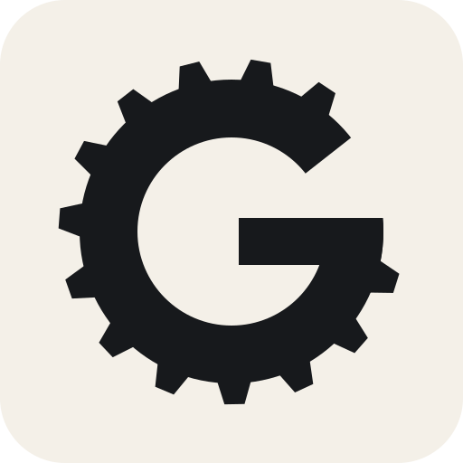

<hr />


<h1>Geer</h1>
<br clear="both"/>

> Free, private, and open source coding agent that challenges the frontier.

Geer runs an agentic coding stack locally on Apple Silicon. T3 Code can drive
a separately installed Claude Code harness while Geer serves a pinned local
model, provides repository retrieval, and records content-free performance
metrics.

Geer selects between reproducible 6-bit and mixed 4/8-bit MLX conversions of
the MIT-licensed upstream Ornith 1.5 model according to the Mac's unified memory.
The independently converted weights are distributed through the
[Geer models on Hugging Face](https://huggingface.co/ilyakam/models) and remain
outside the Git checkout.

## Installation

Geer supports Apple Silicon Macs running macOS 13 or newer with at least 32 GB
of unified memory.

1. Download `Geer-<version>-macOS-arm64.pkg` from the latest
   [GitHub release](https://github.com/ilyakam/geer/releases).
2. Double-click the package and complete the macOS installation.
3. Follow the Geer Setup window that opens after Installer finishes.

The installer includes the `geer` CLI and retains a terminal launcher as a
recovery path. Setup checks the Mac, shows the exact
model, runtime, temporary, and total disk commitment, and asks before
downloading anything. It continues if Claude Code or T3 Code is absent, shows
their installation instructions, and checks again after the model download.
When a retained Ornith 1.0 model is found, setup upgrades it to Ornith 1.5
automatically and removes the retired conversion after the new model passes
verification.

If the setup window was closed, relaunch it from the installed application
files or resume from any terminal with:

```sh
geer setup
```

Depending on the Mac, Geer downloads either 27.1 GiB of 6-bit weights or
20.2 GiB of mixed 4/8-bit weights, plus a 304.1 MiB prebuilt runtime. The
runtime occupies about 1.0 GiB after installation and setup reserves 2.0 GiB
of temporary working space. The model download is resumable.

## Usage

Run `geer` without arguments to start setup or show the current status.

```sh
geer
geer setup
geer status
geer doctor
geer stats
geer uninstall
```

Manage models, the local engine, and app integrations with:

```sh
geer model list
geer model add ornith
geer model use ornith
geer model remove ornith

geer server start
geer server stop
geer server restart
geer server status
geer server logs

geer integration list
geer integration add t3
geer integration remove t3
```

The T3 Code integration adds a **Geer** provider containing the Ornith 1.5
model selected for the Mac. Its provider starts the loopback-only local engine
when needed. Geer supplies Claude Code with a Geer-owned system prompt describing
the active model, interface, and harness without adopting the harness identity.
User-installed Claude Code skills remain available as slash commands without
being copied into Geer. Geer links the user's `~/.claude/skills` directory into
its isolated Claude configuration so T3 Code displays the original
slash-command names. Each macOS account has its own authenticated endpoint.
If the preferred port is occupied, Geer selects and remembers an available port
automatically. Geer never installs or redistributes Claude Code, its skills, or
T3 Code.

Geer supports Apple Silicon Macs with at least 32 GB of unified memory and
selects the model before showing the download plan:

- 64, 96, and 128 GB: 6-bit weights, 256K context, BF16 KV cache.
- 48 GB: mixed 4/8-bit weights, 128K context, BF16 KV cache.
- 32 GB: mixed 4/8-bit weights, 64K context, BF16 KV cache.

Setup reuses the selected model only after verifying it against that model's
pinned conversion manifest. A retained Ornith 1.0 model is replaced by the
verified Ornith 1.5 conversion instead of being kept as an installed rollback.

`geer uninstall` stops the local server, removes the Geer integration from T3
Code, and deletes the packaged CLI and application files. It leaves
`~/.geer` in place and reports how much disk space can be reclaimed by deleting
the retained caches, models, and configuration.

## Development

Contributors can build and test an unsigned development installer without
release-signing credentials. See [CONTRIBUTING.md](CONTRIBUTING.md) for the
portable development, package, onboarding, and validation workflow. Public
release artifacts are signed, notarized, stapled, and Gatekeeper-checked by the
release maintainer or release automation.

## Planned Support

- [ ] Additional T3 Code releases and the local `npx t3` application.
- [ ] Full Claude Code CLI behavior with progressive local prompt caching.
- [ ] Claude desktop.
- [ ] Codex CLI, desktop, and IDE.
- [ ] OpenCode CLI, TUI, web, and desktop.
- [ ] Pi CLI, TUI, RPC, and SDK.
- [ ] Native installation and verification skills for each supported surface.

## Contributing

Contributions are welcome. See
[CONTRIBUTING.md](CONTRIBUTING.md) for the current development, testing,
privacy, provenance, and compatibility requirements. Participation is governed
by the [Code of Conduct](CODE_OF_CONDUCT.md), and security reports follow
[SECURITY.md](SECURITY.md).

## License

Geer's original code and documentation are available under the [MIT
License](LICENSE). Models, runtimes, harnesses, and other third-party
components retain their own licenses and terms.

Geer is an independent project and is not affiliated with or endorsed by
Anthropic, T3 Tools, or Deep Reinforce AI.
